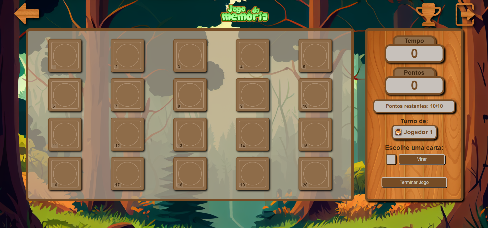

# Memory Game

**Memory Game** is a classic memory game developed using **HTML, CSS, and JavaScript**. It features multiple customization options and game modes for a dynamic and fun experience.

## 🚀 Features

- **User accounts and sessions** managed with `localStorage`.
- **Multiple game modes**:
  - Classic (single-player or up to 4 players).
  - **Countdown** with different difficulty levels.
  - **Trio** for an extra challenge.
  - Combine multiple modes simultaneously.
- **Board customization**:
  - Various themes: Animals, Christmas, Tiles, and more.
  - Different board sizes.
- **Flexible interaction**:
  - Flip cards using the mouse or keyboard.
- **Separate rankings** for each game mode.
- **Information and definitions pages** before starting the game.

## 🎮 How to Play

1. Select the number of players.
2. Choose the board theme and size.
3. Select the game modes you want to activate.
4. Flip the cards to find matching pairs before your opponents.
5. Check the rankings and challenge your best times.

## 📷 Screenshots

<p align="center">
  <h3>Animals 5x4</h3>
  
</p>

<p align="center">
  <h3>Christmas 6x6</h3>
  
</p>

<p align="center">
  <h3>Christmas 6x6</h3>
  
</p>


## 🛠️ Technologies Used

- **HTML** – Game structure.
- **CSS** – Styles and responsive design.
- **JavaScript** – Game logic and data storage using `localStorage`.

## 📌 Installation and Execution

```bash
# Clone the repository
git clone https://github.com/YonaGonca/memory-game.git

# Open the file in the browser
cd memory-game
open index.html
```

## 🤝 Contributing

Since this is a personal project, contributions are not currently being accepted. However, feel free to fork the repository and make modifications for personal use.

If you'd like to suggest improvements or discuss the project, please feel free to open an issue, and I will consider your feedback.

### How to fork and modify:
1. **Fork the repository**: Click the "Fork" button at the top right of this repository to create your own copy of the project.
2. **Clone your forked repo**: 
   ```bash
   git clone https://github.com/YonaGonca/memory-game.git
    ```

## 📜 License

This project is licensed under the **MIT** license. You are free to use and modify it.

## 🙏 Acknowledgments

- **Paint.NET** – For providing a powerful and user-friendly tool for image editing.
- **Stack Overflow** – For the invaluable answers and solutions to coding challenges I encountered while building the project.
- **Google Fonts** – For offering a great variety of open-source fonts that were used in the design.
- **All the artists** – For their contributions of free-use images. Many of the images used in this project were sourced from platforms. I am grateful to all the creators who generously share their work for free use under public licenses.


